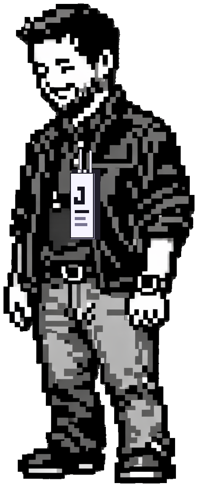

```{=html}
<section class="home-hero" aria-label="Trainer card">
  <div class="home-hero__inner">
    <p class="section-label reveal">Trainer Card</p>

    <div class="hero-card reveal" data-reveal-order="1">
      <div class="hero-card__portrait">
        
      </div>
      <div class="hero-card__stats">
        <div class="hero-card__titlebar">
          <span class="hero-card__name">Jon</span>
          <span class="hero-card__level">Lv. 99 &middot; Biologist / Data Scientist</span>
        </div>
        <div class="gauge gauge--hp">
          <span class="gauge__label">HP</span>
          <span class="gauge__track"><span class="gauge__fill" style="--fill: 0.92"></span></span>
          <span class="gauge__value">92/100</span>
        </div>
        <div class="gauge gauge--xp">
          <span class="gauge__label">EXP</span>
          <span class="gauge__track"><span class="gauge__fill gauge__fill--xp" style="--fill: 0.76"></span></span>
          <span class="gauge__value">Next Lv.</span>
        </div>
        <dl class="hero-card__rows">
          <div class="stat-row"><dt>Type</dt><dd>Biology / Data</dd></div>
          <div class="stat-row"><dt>Origin</dt><dd>Chicago, IL</dd></div>
          <div class="stat-row"><dt>Region</dt><dd>Las Vegas, NV</dd></div>
          <div class="stat-row"><dt>Party</dt><dd>One miniature poodle</dd></div>
          <div class="stat-row"><dt>Strength</dt><dd>Professing</dd></div>
          <div class="stat-row"><dt>Weakness</dt><dd>Gluten</dd></div>
        </dl>
      </div>
    </div>

    <div class="dialog-box reveal" data-reveal-order="2" data-typewriter>
      <p class="dialog-box__text">A wild JON appeared! Evolutionary biologist turned data scientist. Chased invasive snails through national parks; now chases signal through data. Found outside.</p>
      <span class="dialog-box__cursor" aria-hidden="true">&#9660;</span>
    </div>

    <nav class="command-menu reveal" data-reveal-order="3" aria-label="Main actions">
      <a class="command-menu__item" href="https://www.linkedin.com/in/jae-finger/">Connect</a>
      <a class="command-menu__item" href="#side-quests">Projects</a>
      <a class="command-menu__item" href="blog.html">Battle Log</a>
      <a class="command-menu__item" href="about.html">Trainer Info</a>
    </nav>
  </div>
</section>

<section class="home-rail-section" id="side-quests" aria-label="Projects">
  <div class="home-rail-section__inner">
    <header class="rail-head reveal">
      <div>
        <p class="section-label">Side Quests</p>
        <h2 class="rail-head__title">Projects</h2>
      </div>
      <div class="rail-nav">
        <button class="rail-btn" type="button" data-rail-prev aria-label="Previous projects">&larr;</button>
        <button class="rail-btn" type="button" data-rail-next aria-label="Next projects">&rarr;</button>
      </div>
    </header>
    <div class="rail rail--projects reveal" data-rail tabindex="0" role="group" aria-label="Project cards">
      <a class="project-card" href="https://uselesstools.jonfinger.com/">
        <h3 class="project-card__title">Useless Tools</h3>
        <p class="project-card__summary">A collection of useless tools that approach generating insights and shareholder value with malicious compliance.</p>
        <div class="project-card__tags"><span class="project-tag">JavaScript</span><span class="project-tag">Web</span></div>
      </a>
      <a class="project-card" href="https://www.dissertations.wsu.edu/Thesis/Spring2018/J_Finger_041718.pdf">
        <h3 class="project-card__title">Biology Masters Thesis</h3>
        <p class="project-card__summary">Modeling the range expansion of the New Zealand mudsnail — an invasive species spreading through Western waterways.</p>
        <div class="project-card__tags"><span class="project-tag">Invasion Biology</span><span class="project-tag">Population Genetics</span><span class="project-tag">Paper</span></div>
      </a>
      <a class="project-card" href="about.html">
        <h3 class="project-card__title">This Website</h3>
        <p class="project-card__summary">A portfolio played like a turn-based RPG. Built with Quarto, hand-rolled CSS, and zero frameworks.</p>
        <div class="project-card__tags"><span class="project-tag">Quarto</span><span class="project-tag">CSS</span></div>
      </a>
    </div>
  </div>
</section>

<section class="home-rail-section" id="battle-log" aria-label="Blog posts">
  <div class="home-rail-section__inner">
    <header class="rail-head reveal">
      <div>
        <p class="section-label">Battle Log</p>
        <h2 class="rail-head__title">Recent encounters</h2>
      </div>
      <div class="rail-nav">
        <a class="rail-view-all" href="blog.html">View all</a>
        <button class="rail-btn" type="button" data-rail-prev aria-label="Previous posts">&larr;</button>
        <button class="rail-btn" type="button" data-rail-next aria-label="Next posts">&rarr;</button>
      </div>
    </header>
    <div class="rail rail--battles reveal" data-rail tabindex="0" role="group" aria-label="Blog post cards">

      <a href="posts/2026-02-28-maybe-we-didnt-think-about-cost-enough.html" class="battle-card">
        <article class="battle-card__frame">
          <div class="battle-card__scene">
            <div class="battle-card__arena-tag" aria-hidden="true">COST PRESSURE</div>
            <div class="battle-card__status battle-card__status--foe" aria-hidden="true">
              <span class="battle-card__status-name">Benjamin Bruiser</span>
              <span class="battle-card__status-bars"><span></span><span></span><span></span><span></span></span>
            </div>
            <div class="battle-card__status battle-card__status--trainer" aria-hidden="true">
              <span class="battle-card__status-name">Jon</span>
              <span class="battle-card__status-bars"><span></span><span></span><span></span></span>
            </div>
            <div class="battle-card__foe">
              
            </div>
            <div class="battle-card__trainer" aria-hidden="true"><div class="battle-card__trainer-sprite"></div></div>
            <div class="battle-card__terrain" aria-hidden="true"></div>
            <div class="battle-card__hook" aria-hidden="true">
              <span class="battle-card__hook-label">Quote</span>
              <strong>It also takes a lot of energy to train a human. - Sam Altman</strong>
            </div>
          </div>
          <div class="battle-card__body">
            <div class="battle-card__meta"><div class="battle-card__date">Feb 28, 2026</div></div>
            <h3 class="battle-card__title">Maybe It Was All About The Benjamins After All</h3>
          </div>
        </article>
      </a>

      <a href="posts/2026-02-23-ai-is-accelerating-productivity-and-angst.html" class="battle-card">
        <article class="battle-card__frame">
          <div class="battle-card__scene">
            <div class="battle-card__arena-tag" aria-hidden="true">ADAPTATION CHECK</div>
            <div class="battle-card__status battle-card__status--foe" aria-hidden="true">
              <span class="battle-card__status-name">Deadline Tangle</span>
              <span class="battle-card__status-bars"><span></span><span></span><span></span><span></span></span>
            </div>
            <div class="battle-card__status battle-card__status--trainer" aria-hidden="true">
              <span class="battle-card__status-name">Jon</span>
              <span class="battle-card__status-bars"><span></span><span></span><span></span></span>
            </div>
            <div class="battle-card__foe">
              
            </div>
            <div class="battle-card__trainer" aria-hidden="true"><div class="battle-card__trainer-sprite"></div></div>
            <div class="battle-card__terrain" aria-hidden="true"></div>
            <div class="battle-card__hook" aria-hidden="true">
              <span class="battle-card__hook-label">Quote</span>
              <strong>All living things are soft and supple; the dead are brittle and dry. - Laozi</strong>
            </div>
          </div>
          <div class="battle-card__body">
            <div class="battle-card__meta"><div class="battle-card__date">Feb 23, 2026</div></div>
            <h3 class="battle-card__title">AI Is Accelerating Productivity &amp; Angst</h3>
          </div>
        </article>
      </a>

      <a href="posts/2026-02-08-building-python-portfolio.html" class="battle-card">
        <article class="battle-card__frame">
          <div class="battle-card__scene">
            <div class="battle-card__arena-tag" aria-hidden="true">HYBRID BUILD</div>
            <div class="battle-card__status battle-card__status--foe" aria-hidden="true">
              <span class="battle-card__status-name">Scholar Poodle</span>
              <span class="battle-card__status-bars"><span></span><span></span><span></span><span></span></span>
            </div>
            <div class="battle-card__status battle-card__status--trainer" aria-hidden="true">
              <span class="battle-card__status-name">Jon</span>
              <span class="battle-card__status-bars"><span></span><span></span><span></span></span>
            </div>
            <div class="battle-card__foe">
              
            </div>
            <div class="battle-card__trainer" aria-hidden="true"><div class="battle-card__trainer-sprite"></div></div>
            <div class="battle-card__terrain" aria-hidden="true"></div>
            <div class="battle-card__hook" aria-hidden="true">
              <span class="battle-card__hook-label">Quote</span>
              <strong>Biology trained me to think in systems. Education trained me to explain them.</strong>
            </div>
          </div>
          <div class="battle-card__body">
            <div class="battle-card__meta"><div class="battle-card__date">Feb 18, 2026</div></div>
            <h3 class="battle-card__title">The Geometry of Thought Between Biology, Teaching, and Code</h3>
          </div>
        </article>
      </a>

    </div>
  </div>
</section>

<section class="home-continue" aria-label="Get in touch">
  <div class="home-continue__inner reveal">
    <p class="home-continue__prompt">Continue<span class="home-continue__blink" aria-hidden="true">?</span></p>
    <div class="home-continue__cta">
      <a class="btn-signal" href="https://www.linkedin.com/in/jae-finger/">Connect on LinkedIn</a>
      <a class="btn-ghost" href="https://bsky.app/profile/jonfinger.com">Bluesky</a>
    </div>
  </div>
</section>
```
